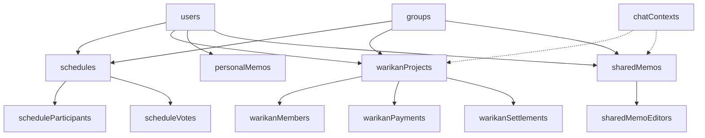

# LINE秘書 データベース設計書

## 1. 概要

本ドキュメントは、AI秘書サービス「TASK」のデータベース設計について定義します。本システムはFirebase Firestoreを採用し、NoSQLデータベースとして柔軟性とスケーラビリティを確保しています。

### 1.1 システム概要
- **プロダクト名**: AI秘書「TASK」
- **プラットフォーム**: LINE (LIFF + Messaging API)
- **主要機能**: 日程調整、割り勘、個人メモ、共有メモ
- **データベース**: Firebase Firestore (NoSQL)
- **AI連携**: Google Gemini API

### 1.2 設計方針
- スケーラビリティを重視したNoSQL設計
- 非正規化による読み取りパフォーマンスの最適化
- リアルタイム同期を活用した即時性の確保
- セキュリティルールによる厳格なアクセス制御

## 2. 全体データベースアーキテクチャ

### 2.1 アーキテクチャ概要
```
┌─────────────────┐         ┌─────────────────┐         ┌─────────────────┐
│   LINE Users    │────────▶│    Bot API      │────────▶│   Firestore     │
└─────────────────┘         │   (Backend)     │         │   Database      │
                           └─────────────────┘         └─────────────────┘
                                    │                           ▲
                                    │                           │
                           ┌─────────────────┐                 │
                           │     Worker      │─────────────────┘
                           │ (Gemini Proc)   │
                           └─────────────────┘
```

### 2.2 データフロー
1. **書き込み**: すべてのデータ書き込みはバックエンド（Bot API/Worker）経由で実行
2. **読み取り**: LIFFアプリはFirestoreから直接読み取り可能（認証済みユーザーのみ）
3. **非同期処理**: AI処理（Gemini API）はWorker経由で非同期実行

## 3. コレクション設計

### 3.1 メインコレクション一覧

| コレクション名 | 説明 | キー構造 |
|--------------|------|---------|
| users | システム利用者情報 | lineUserId |
| groups | LINEグループ情報 | lineGroupId |
| chatContexts | チャット状態管理 | chatId |
| schedules | 日程調整情報 | 自動生成ID |
| warikanProjects | 割り勘プロジェクト | 自動生成ID |
| personalMemos | 個人メモ | 自動生成ID |
| memoPages | メモページ階層 | 自動生成ID |
| sharedMemos | 共有メモ | 自動生成ID |
| messageLogs | 会話ログ | 自動生成ID |

### 3.2 詳細コレクション定義

#### 3.2.1 users コレクション
**役割**: システムが認識している全てのLINEユーザー情報を管理

| フィールド名 | データ型 | 必須 | デフォルト値 | 説明 |
|------------|---------|------|------------|------|
| lineUserId | String | ○ | - | LINE User ID (PK) |
| status | String | ○ | 'pending' | 'active'(友だち), 'pending'(グループ参加のみ), 'inactive'(ブロック等) |
| displayName | String | - | - | LINE表示名 |
| pictureUrl | String | - | - | プロフィール画像URL |
| createdAt | Timestamp | ○ | サーバータイムスタンプ | 初回認識日時 |
| updatedAt | Timestamp | ○ | サーバータイムスタンプ | 最終更新日時 |
| friendAddedAt | Timestamp | - | null | 友だち登録日時 |
| settings | Map | - | {} | ユーザー個別設定 |

#### 3.2.2 groups コレクション
**役割**: AI秘書が参加しているLINEグループ情報を管理

| フィールド名 | データ型 | 必須 | デフォルト値 | 説明 |
|------------|---------|------|------------|------|
| lineGroupId | String | ○ | - | LINE Group ID (PK) |
| groupName | String | - | - | グループ名 |
| createdAt | Timestamp | ○ | サーバータイムスタンプ | Bot初回参加日時 |
| updatedAt | Timestamp | ○ | サーバータイムスタンプ | 最終更新日時 |
| members | Map<String, Timestamp> | - | {} | 認識メンバーと最終アクティブ日時 |

#### 3.2.3 chatContexts コレクション
**役割**: 各チャットの現在の状態を管理

| フィールド名 | データ型 | 必須 | デフォルト値 | 説明 |
|------------|---------|------|------------|------|
| chatId | String | ○ | - | チャットID (PK) |
| chatType | String | ○ | - | 'user' または 'group' |
| activeWarikanProjectId | String | - | null | アクティブな割り勘プロジェクトID |
| activeSharedMemoId | String | - | null | アクティブな共有メモID |
| lastCommand | String | - | - | 最後に実行されたコマンド |
| updatedAt | Timestamp | ○ | サーバータイムスタンプ | 最終更新日時 |

#### 3.2.4 schedules コレクション
**役割**: 日程調整イベントの情報を管理

| フィールド名 | データ型 | 必須 | デフォルト値 | 説明 |
|------------|---------|------|------------|------|
| scheduleId | String | ○ | 自動生成 | スケジュールID (PK) |
| title | String | ○ | - | タイトル |
| description | String | - | "" | 詳細説明 |
| status | String | ○ | 'adjusting' | 'adjusting', 'confirmed', 'cancelled' |
| createdBy | String | ○ | - | 作成者のlineUserId |
| groupId | String | - | null | 関連グループID |
| createdAt | Timestamp | ○ | サーバータイムスタンプ | 作成日時 |
| updatedAt | Timestamp | ○ | サーバータイムスタンプ | 最終更新日時 |
| candidateDates | Array<Map> | - | [] | 候補日時リスト |
| confirmedDateTime | Timestamp | - | null | 確定日時 |

**サブコレクション**:
- `scheduleParticipants`: 参加者情報
- `scheduleVotes`: 投票情報

#### 3.2.5 warikanProjects コレクション
**役割**: 割り勘プロジェクトの情報を管理

| フィールド名 | データ型 | 必須 | デフォルト値 | 説明 |
|------------|---------|------|------------|------|
| projectId | String | ○ | 自動生成 | プロジェクトID (PK) |
| projectName | String | ○ | - | プロジェクト名 |
| status | String | ○ | 'active' | 'active'(未精算), 'settled'(精算済) |
| createdBy | String | ○ | - | 作成者のlineUserId |
| groupId | String | - | null | 関連グループID |
| shareUrlToken | String | - | null | 共有URL用トークン |
| createdAt | Timestamp | ○ | サーバータイムスタンプ | 作成日時 |
| updatedAt | Timestamp | ○ | サーバータイムスタンプ | 最終更新日時 |
| totalAmount | Number | ○ | 0 | 支払い合計金額（非正規化） |
| memberCount | Number | ○ | 0 | 参加人数（非正規化） |

**サブコレクション**:
- `warikanMembers`: メンバー情報
- `warikanPayments`: 支払い記録
- `warikanSettlements`: 精算情報

#### 3.2.6 personalMemos コレクション
**役割**: 個人メモの内容を管理

| フィールド名 | データ型 | 必須 | デフォルト値 | 説明 |
|------------|---------|------|------------|------|
| memoId | String | ○ | 自動生成 | メモID (PK) |
| userId | String | ○ | - | 所有者のlineUserId |
| content | String | - | "" | メモ本文（Markdown） |
| tags | Array<String> | - | [] | タグ |
| source | String | - | 'line' | 入力元 ('line', 'liff') |
| createdAt | Timestamp | ○ | サーバータイムスタンプ | 作成日時 |
| updatedAt | Timestamp | ○ | サーバータイムスタンプ | 最終更新日時 |
| pageId | String | - | null | 紐づくページID |
| isArchived | Boolean | - | false | アーカイブフラグ |
| aiAnalysis | Map | - | null | Gemini解析結果 |

#### 3.2.7 sharedMemos コレクション
**役割**: グループで共有されるメモを管理

| フィールド名 | データ型 | 必須 | デフォルト値 | 説明 |
|------------|---------|------|------------|------|
| sharedMemoId | String | ○ | 自動生成 | 共有メモID (PK) |
| title | String | ○ | - | タイトル |
| templateType | String | - | 'free' | 'meeting', 'outing', 'free' |
| content | String | - | "" | メモ本文 |
| createdBy | String | ○ | - | 作成者のlineUserId |
| groupId | String | - | null | 関連グループID |
| createdAt | Timestamp | ○ | サーバータイムスタンプ | 作成日時 |
| updatedAt | Timestamp | ○ | サーバータイムスタンプ | 最終更新日時 |
| lastEditorId | String | - | null | 最終編集者ID |
| readableUserIds | Array<String> | ○ | [] | アクセス可能ユーザーリスト（非正規化） |
| isArchived | Boolean | - | false | アーカイブフラグ |

**サブコレクション**:
- `sharedMemoEditors`: 編集権限を持つユーザーリスト

#### 3.2.8 messageLogs コレクション
**役割**: 会話履歴を保存（プライバシー対応必須）

| フィールド名 | データ型 | 必須 | デフォルト値 | 説明 |
|------------|---------|------|------------|------|
| messageId | String | ○ | 自動生成 | メッセージID (PK) |
| chatId | String | ○ | - | チャットID |
| chatType | String | ○ | - | 'user' または 'group' |
| userId | String | ○ | - | 送信者ID |
| type | String | ○ | - | メッセージ種別 |
| text | String | - | - | テキスト内容 |
| lineTimestamp | Timestamp | ○ | - | イベント発生日時 |
| createdAt | Timestamp | ○ | サーバータイムスタンプ | 保存日時 |

## 4. リレーションシップとデータフロー

### 4.1 主要なリレーションシップ



### 4.2 データフローパターン

#### 4.2.1 割り勘フロー
1. プロジェクト作成 → `warikanProjects` に新規ドキュメント
2. メンバー追加 → `warikanMembers` サブコレクションに追加
3. 支払い記録 → `warikanPayments` サブコレクションに追加
4. 精算計算 → `warikanSettlements` サブコレクションに結果保存
5. 非正規化フィールド（`totalAmount`, `memberCount`）の更新

#### 4.2.2 日程調整フロー
1. 調整開始 → `schedules` に新規ドキュメント
2. 参加者追加 → `scheduleParticipants` サブコレクションに追加
3. 投票 → `scheduleVotes` サブコレクションに追加/更新
4. 確定 → `schedules` の `status` と `confirmedDateTime` を更新

#### 4.2.3 共有メモフロー
1. メモ作成 → `sharedMemos` に新規ドキュメント
2. 編集者追加 → `sharedMemoEditors` サブコレクションに追加
3. `readableUserIds` 配列の更新（非正規化）
4. AI要約実行 → `messageLogs` から会話取得 → Gemini処理 → 結果保存

## 5. インデックス戦略

### 5.1 複合インデックス設定

#### 5.1.1 warikanPayments
- **対象フィールド**: `projectId` (ASC), `createdAt` (DESC)
- **用途**: 特定プロジェクトの支払いを新しい順に取得

#### 5.1.2 personalMemos
- **対象フィールド**: `userId` (ASC), `createdAt` (DESC)
- **用途**: 特定ユーザーのメモを新しい順に取得

#### 5.1.3 sharedMemos
- **対象フィールド**: `readableUserIds` (ARRAY_CONTAINS), `updatedAt` (DESC)
- **用途**: アクセス可能な共有メモを更新順に取得

#### 5.1.4 messageLogs
- **対象フィールド**: `chatId` (ASC), `lineTimestamp` (DESC)
- **用途**: 特定チャットのメッセージを時系列で取得

### 5.2 単一フィールドインデックス
- `users.lineUserId`: ユニークインデックス
- `groups.lineGroupId`: ユニークインデックス
- `warikanProjects.shareUrlToken`: ゲストアクセス用
- `schedules.status`: ステータス別フィルタリング

## 6. データセキュリティとプライバシー

### 6.1 アクセス制御

#### 6.1.1 Firestore Security Rules
```javascript
// 書き込みは全てバックエンド経由
match /{document=**} {
  allow write: if false;
}

// 読み取りは認証済みユーザーのみ
match /users/{userId} {
  allow read: if request.auth != null && request.auth.uid == userId;
}

match /personalMemos/{memoId} {
  allow read: if request.auth != null && 
    request.auth.uid == resource.data.userId;
}

match /sharedMemos/{memoId} {
  allow read: if request.auth != null && 
    request.auth.uid in resource.data.readableUserIds;
}
```

#### 6.1.2 バックエンド認可
- Service層で操作権限チェック
- リソース所有者、メンバー、編集者の権限検証
- Firebase Auth IDトークンによる認証

### 6.2 プライバシー保護

#### 6.2.1 会話ログ（messageLogs）
- **重要**: 全メッセージ保存のため、プライバシーポリシーの明示が必須
- ユーザー同意の取得プロセスを実装
- 保存期間の設定と自動削除機能の実装予定
- アクセスログの記録

#### 6.2.2 個人情報の取り扱い
- LINE表示名、プロフィール画像URLは最小限の保存
- 不要な個人情報は収集しない
- データの暗号化（転送時：HTTPS、保存時：Firestore標準）

### 6.3 データ保持ポリシー
- アクティブデータ：無期限
- アーカイブデータ：1年後に自動削除（予定）
- 会話ログ：90日後に自動削除（予定）
- バックアップ：日次自動バックアップ（7日間保持）

## 7. マイグレーションとバージョニング

### 7.1 スキーマ変更方針
- 後方互換性を維持
- 新フィールドはオプショナルとして追加
- 破壊的変更は新コレクションで対応
- マイグレーションスクリプトの作成と管理

### 7.2 バージョン管理
- Zodスキーマでの型定義管理
- スキーマバージョンフィールドの追加（将来）
- 変更履歴の文書化

## 8. パフォーマンス最適化

### 8.1 非正規化戦略

#### 8.1.1 実装済み非正規化フィールド
- `warikanProjects.totalAmount`: 支払い合計の事前計算
- `warikanProjects.memberCount`: メンバー数の事前計算
- `sharedMemos.readableUserIds`: アクセス可能ユーザーの配列化

#### 8.1.2 更新戦略
- トランザクション内での一貫性保証
- Cloud Functionsによる自動更新（一部）
- バックエンドでの同期的更新

### 8.2 クエリ最適化

#### 8.2.1 ページネーション
- カーソルベースのページネーション実装
- `limit()`と`startAfter()`の活用
- 無限スクロール対応

#### 8.2.2 キャッシング戦略
- React Queryによるクライアントサイドキャッシュ
- Firestoreのオフラインキャッシュ活用
- 静的データのCDN配信（将来）

### 8.3 スケーラビリティ考慮事項
- コレクションのシャーディング（将来）
- ホットスポット回避のためのIDランダム化
- 読み取り負荷の分散（レプリカ利用）

## 9. モニタリングと運用

### 9.1 監視項目
- Firestore読み取り/書き込み/削除オペレーション数
- ストレージ使用量
- クエリレイテンシ
- エラー率

### 9.2 アラート設定
- 使用量の閾値超過
- エラー率の急増
- レイテンシの異常

### 9.3 バックアップとリカバリ
- 日次自動バックアップ
- ポイントインタイムリカバリ（7日間）
- 災害復旧計画の策定

## 10. 今後の拡張計画

### 10.1 短期計画（3ヶ月以内）
- 全文検索機能の実装（Algolia連携）
- より詳細な権限管理システム
- データエクスポート機能

### 10.2 中期計画（6ヶ月以内）
- リアルタイム共同編集（Operational Transform）
- 外部カレンダー連携
- 高度なAI分析機能

### 10.3 長期計画（1年以内）
- マルチテナント対応
- グローバル展開に向けたマルチリージョン対応
- エンタープライズ向け機能拡充

## 付録

### A. Firestoreドキュメントパス例
```
/users/{lineUserId}
/groups/{lineGroupId}
/chatContexts/{chatId}
/schedules/{scheduleId}
/schedules/{scheduleId}/scheduleParticipants/{participantId}
/schedules/{scheduleId}/scheduleVotes/{voteId}
/warikanProjects/{projectId}
/warikanProjects/{projectId}/warikanMembers/{memberId}
/warikanProjects/{projectId}/warikanPayments/{paymentId}
/warikanProjects/{projectId}/warikanSettlements/{settlementId}
/personalMemos/{memoId}
/memoPages/{pageId}
/sharedMemos/{sharedMemoId}
/sharedMemos/{sharedMemoId}/sharedMemoEditors/{editorUserId}
/messageLogs/{logId}
```

### B. 参考資料
- Firebase Firestore公式ドキュメント
- LINE Messaging API仕様書
- Google Gemini API仕様書
- プロジェクト内部設計書

---

*最終更新日: 2025年1月*
*バージョン: 1.0*