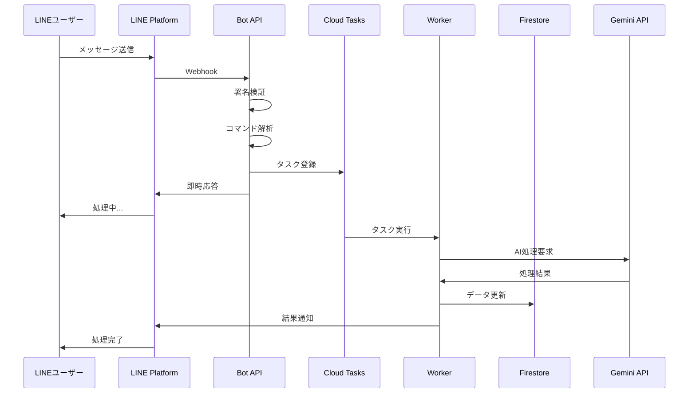
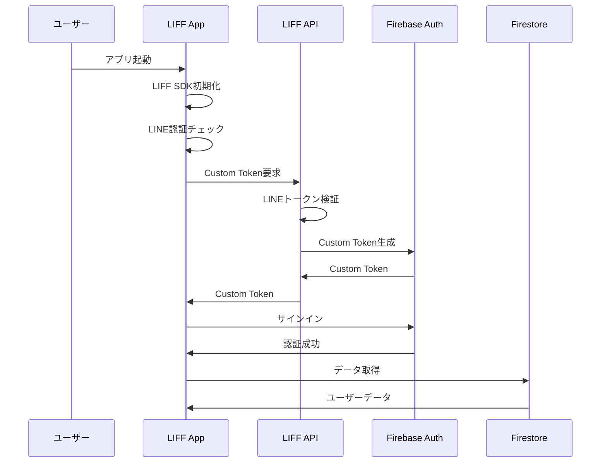
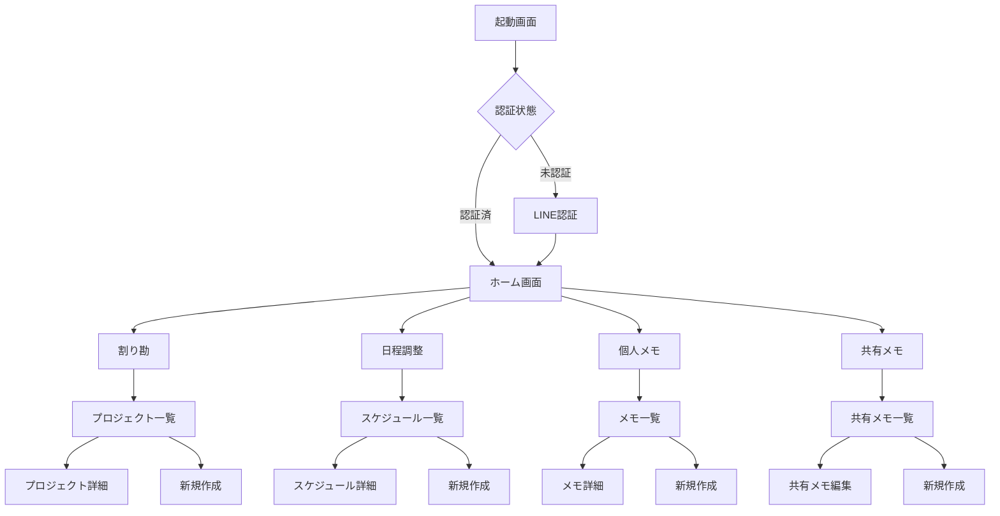
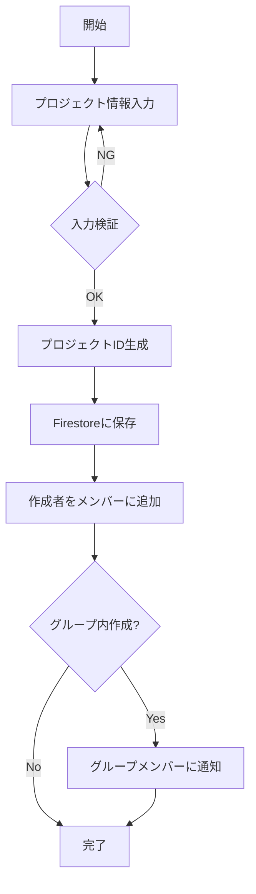
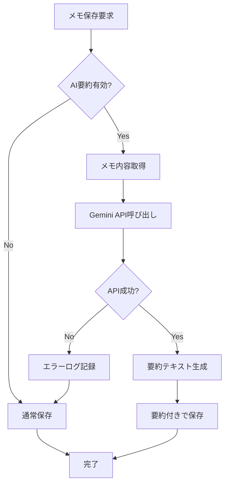

# LINE秘書 TASK 詳細設計書

## 1. はじめに

### 1.1 目的
本書は、LINE秘書 TASKシステムの詳細設計を定義し、開発チームが実装を行うための技術的な指針を提供することを目的とする。

### 1.2 対象読者
- 開発エンジニア
- システムアーキテクト
- QAエンジニア
- プロジェクトマネージャー

### 1.3 関連ドキュメント
- プロジェクト概要書
- 機能一覧・要件定義書
- MVP開発計画書
- データベース設計書

## 2. システムアーキテクチャ詳細

### 2.1 全体構成図

```
┌─────────────────┐     ┌─────────────────┐     ┌─────────────────┐
│   LINE Users    │     │   LIFF Apps     │     │  External APIs  │
└────────┬────────┘     └────────┬────────┘     └────────┬────────┘
         │                       │                         │
         ▼                       ▼                         ▼
┌─────────────────────────────────────────────────────────────────┐
│                        Google Cloud Platform                      │
│  ┌─────────────┐  ┌──────────────┐  ┌─────────────────────┐   │
│  │  Cloud Run   │  │ Cloud Tasks  │  │  Cloud Functions    │   │
│  │  ┌─────────┐│  │              │  │                     │   │
│  │  │Bot API  ││  │   Worker     │  │  Scheduled Jobs     │   │
│  │  └─────────┘│  │   Queue      │  │  - Cleanup          │   │
│  │  ┌─────────┐│  │              │  │  - Notifications    │   │
│  │  │LIFF API ││  │              │  │  - Analytics        │   │
│  │  └─────────┘│  │              │  │                     │   │
│  └─────────────┘  └──────────────┘  └─────────────────────┘   │
│         │                 │                      │              │
│         ▼                 ▼                      ▼              │
│  ┌──────────────────────────────────────────────────────────┐  │
│  │                    Firebase Firestore                     │  │
│  └──────────────────────────────────────────────────────────┘  │
│  ┌──────────────────────────────────────────────────────────┐  │
│  │              Cloud Storage (Files & Images)               │  │
│  └──────────────────────────────────────────────────────────┘  │
└─────────────────────────────────────────────────────────────────┘
```

### 2.2 コンポーネント詳細

#### 2.2.1 Bot API (Cloud Run)
```typescript
// ディレクトリ構造
apps/bot/
├── src/
│   ├── controllers/
│   │   ├── webhook.controller.ts
│   │   ├── health.controller.ts
│   │   └── metrics.controller.ts
│   ├── services/
│   │   ├── line.service.ts
│   │   ├── message-handler.service.ts
│   │   ├── command-parser.service.ts
│   │   └── ai.service.ts
│   ├── models/
│   │   ├── user.model.ts
│   │   ├── group.model.ts
│   │   └── context.model.ts
│   ├── middleware/
│   │   ├── auth.middleware.ts
│   │   ├── rate-limit.middleware.ts
│   │   └── error.middleware.ts
│   ├── utils/
│   │   ├── logger.ts
│   │   └── metrics.ts
│   └── main.ts
├── Dockerfile
└── package.json
```

**主要責務:**
- LINE Webhook受信・検証
- メッセージ解析・コマンド判定
- 非同期タスクのCloud Tasksへの登録
- 即時レスポンスの返却

#### 2.2.2 Worker (Cloud Tasks)
```typescript
// ディレクトリ構造
apps/worker/
├── src/
│   ├── handlers/
│   │   ├── warikan.handler.ts
│   │   ├── schedule.handler.ts
│   │   ├── memo.handler.ts
│   │   └── notification.handler.ts
│   ├── processors/
│   │   ├── ai-processor.ts
│   │   ├── image-processor.ts
│   │   └── data-processor.ts
│   ├── repositories/
│   │   ├── user.repository.ts
│   │   ├── warikan.repository.ts
│   │   ├── schedule.repository.ts
│   │   └── memo.repository.ts
│   └── main.ts
├── Dockerfile
└── package.json
```

**主要責務:**
- 重い処理の非同期実行
- AI API呼び出し
- データベース更新
- 通知送信

#### 2.2.3 LIFF API (Cloud Run)
```typescript
// ディレクトリ構造
apps/liff-api/
├── src/
│   ├── controllers/
│   │   ├── auth.controller.ts
│   │   ├── warikan.controller.ts
│   │   ├── schedule.controller.ts
│   │   ├── memo.controller.ts
│   │   └── user.controller.ts
│   ├── services/
│   │   ├── firebase-auth.service.ts
│   │   ├── line-auth.service.ts
│   │   └── token.service.ts
│   ├── middleware/
│   │   ├── cors.middleware.ts
│   │   ├── auth.middleware.ts
│   │   └── validation.middleware.ts
│   └── main.ts
├── Dockerfile
└── package.json
```

**主要責務:**
- LIFF アプリケーション用REST API提供
- Firebase Custom Token発行
- データベースCRUD操作
- 権限チェック

### 2.3 データフロー

#### 2.3.1 メッセージ受信フロー


#### 2.3.2 LIFF認証フロー


## 3. API設計仕様

### 3.1 Bot API エンドポイント

#### 3.1.1 Webhook受信
```yaml
endpoint: POST /webhook
headers:
  x-line-signature: string (required)
  content-type: application/json
body:
  destination: string
  events: Array<WebhookEvent>
response:
  200 OK: 正常受信
  400 Bad Request: 署名検証失敗
  500 Internal Server Error: サーバーエラー
```

#### 3.1.2 ヘルスチェック
```yaml
endpoint: GET /health
response:
  200 OK:
    status: "healthy"
    timestamp: ISO8601
    version: string
```

### 3.2 LIFF API エンドポイント

#### 3.2.1 認証関連

##### Custom Token取得
```yaml
endpoint: POST /api/auth/custom-token
headers:
  authorization: Bearer {LINE_ACCESS_TOKEN}
body:
  lineUserId: string
response:
  200 OK:
    customToken: string
    expiresIn: number
  401 Unauthorized: 無効なトークン
```

#### 3.2.2 割り勘機能

##### プロジェクト一覧取得
```yaml
endpoint: GET /api/warikan/projects
headers:
  authorization: Bearer {FIREBASE_ID_TOKEN}
query:
  limit: number (default: 20)
  cursor: string (optional)
response:
  200 OK:
    projects: Array<WarikanProject>
    nextCursor: string | null
```

##### プロジェクト作成
```yaml
endpoint: POST /api/warikan/projects
headers:
  authorization: Bearer {FIREBASE_ID_TOKEN}
body:
  name: string
  totalAmount: number
  description: string (optional)
  groupId: string (optional)
response:
  201 Created:
    projectId: string
    project: WarikanProject
```

##### プロジェクト詳細取得
```yaml
endpoint: GET /api/warikan/projects/{projectId}
headers:
  authorization: Bearer {FIREBASE_ID_TOKEN}
response:
  200 OK:
    project: WarikanProject
    members: Array<WarikanMember>
    items: Array<WarikanItem>
  404 Not Found: プロジェクトが存在しない
```

##### メンバー追加
```yaml
endpoint: POST /api/warikan/projects/{projectId}/members
headers:
  authorization: Bearer {FIREBASE_ID_TOKEN}
body:
  lineUserId: string (optional)
  displayName: string
  amount: number (optional)
response:
  201 Created:
    memberId: string
    member: WarikanMember
```

#### 3.2.3 日程調整機能

##### スケジュール作成
```yaml
endpoint: POST /api/schedules
headers:
  authorization: Bearer {FIREBASE_ID_TOKEN}
body:
  title: string
  description: string (optional)
  candidateDates: Array<{
    date: string (YYYY-MM-DD)
    startTime: string (HH:mm)
    endTime: string (HH:mm)
  }>
  groupId: string (optional)
response:
  201 Created:
    scheduleId: string
    schedule: Schedule
```

##### 投票登録
```yaml
endpoint: POST /api/schedules/{scheduleId}/votes
headers:
  authorization: Bearer {FIREBASE_ID_TOKEN}
body:
  votes: Array<{
    candidateId: string
    availability: "available" | "maybe" | "unavailable"
    comment: string (optional)
  }>
response:
  200 OK:
    voteId: string
    votes: Array<Vote>
```

#### 3.2.4 メモ機能

##### 個人メモ一覧取得
```yaml
endpoint: GET /api/memos/personal
headers:
  authorization: Bearer {FIREBASE_ID_TOKEN}
query:
  viewMode: "timeline" | "structure" | "graph"
  tags: string[] (optional)
  limit: number (default: 50)
  cursor: string (optional)
response:
  200 OK:
    memos: Array<PersonalMemo>
    nextCursor: string | null
```

##### 個人メモ作成
```yaml
endpoint: POST /api/memos/personal
headers:
  authorization: Bearer {FIREBASE_ID_TOKEN}
body:
  title: string
  content: string
  tags: string[] (optional)
  parentMemoId: string (optional)
response:
  201 Created:
    memoId: string
    memo: PersonalMemo
```

##### 共有メモ作成
```yaml
endpoint: POST /api/memos/shared
headers:
  authorization: Bearer {FIREBASE_ID_TOKEN}
body:
  title: string
  content: string
  templateType: string (optional)
  groupId: string
  editorUserIds: string[] (optional)
response:
  201 Created:
    memoId: string
    memo: SharedMemo
```

### 3.3 エラーレスポンス形式
```json
{
  "error": {
    "code": "ERROR_CODE",
    "message": "人間が読めるエラーメッセージ",
    "details": {
      "field": "エラーの詳細情報"
    }
  }
}
```

### 3.4 共通エラーコード
| コード | HTTPステータス | 説明 |
|-------|--------------|------|
| UNAUTHORIZED | 401 | 認証エラー |
| FORBIDDEN | 403 | 権限エラー |
| NOT_FOUND | 404 | リソースが見つからない |
| VALIDATION_ERROR | 400 | バリデーションエラー |
| RATE_LIMIT_EXCEEDED | 429 | レート制限超過 |
| INTERNAL_ERROR | 500 | 内部エラー |

## 4. 画面設計・UI仕様

### 4.1 LIFF アプリケーション画面構成

#### 4.1.1 画面遷移図


#### 4.1.2 共通UIコンポーネント

##### ヘッダー
```typescript
interface HeaderProps {
  title: string;
  showBack?: boolean;
  rightAction?: {
    icon: string;
    onClick: () => void;
  };
}
```

##### ボトムナビゲーション
```typescript
interface BottomNavItem {
  icon: string;
  label: string;
  path: string;
  badge?: number;
}

const navItems: BottomNavItem[] = [
  { icon: "home", label: "ホーム", path: "/" },
  { icon: "split", label: "割り勘", path: "/warikan" },
  { icon: "calendar", label: "日程", path: "/schedule" },
  { icon: "note", label: "メモ", path: "/memo" }
];
```

##### ローディング
```typescript
interface LoadingProps {
  fullScreen?: boolean;
  message?: string;
}
```

##### エラー表示
```typescript
interface ErrorProps {
  message: string;
  retry?: () => void;
}
```

### 4.2 主要画面詳細

#### 4.2.1 ホーム画面
- **概要**: 各機能への導線と最新情報の表示
- **レイアウト**:
  ```
  ┌─────────────────────────┐
  │      LINE秘書 TASK      │ <- ヘッダー
  ├─────────────────────────┤
  │ ┌─────────┬─────────┐  │
  │ │ 割り勘  │ 日程調整 │  │ <- 機能カード
  │ └─────────┴─────────┘  │
  │ ┌─────────┬─────────┐  │
  │ │個人メモ │共有メモ  │  │
  │ └─────────┴─────────┘  │
  │                         │
  │ [最近の活動]            │
  │ ・割り勘「飲み会」...   │
  │ ・日程調整「会議」...   │
  │ ・メモ更新「アイデ...   │
  └─────────────────────────┘
  ```

#### 4.2.2 割り勘プロジェクト詳細画面
- **概要**: プロジェクトの詳細情報と精算状況
- **主要要素**:
  - プロジェクト情報（名前、総額、作成日）
  - メンバーリスト（支払い状況付き）
  - 明細リスト（品目、金額）
  - アクション（メンバー追加、明細追加、精算）
- **状態管理**:
  ```typescript
  interface WarikanDetailState {
    project: WarikanProject;
    members: WarikanMember[];
    items: WarikanItem[];
    isLoading: boolean;
    error: Error | null;
  }
  ```

#### 4.2.3 日程調整投票画面
- **概要**: 候補日への投票インターフェース
- **投票UI**:
  ```
  ┌─────────────────────────┐
  │    会議の日程調整        │
  ├─────────────────────────┤
  │ 12/15(金) 14:00-16:00   │
  │ [○] [△] [×]           │ <- 選択ボタン
  │ コメント: ________      │
  ├─────────────────────────┤
  │ 12/16(土) 10:00-12:00   │
  │ [○] [△] [×]           │
  │ コメント: ________      │
  ├─────────────────────────┤
  │    [投票する]           │
  └─────────────────────────┘
  ```

#### 4.2.4 個人メモ一覧画面
- **概要**: 3つの表示モードを切り替え可能
- **表示モード**:
  1. **タイムライン**: 時系列順
  2. **構造**: 階層構造表示
  3. **グラフ**: 関連性を可視化
- **フィルタ・検索**:
  - タグフィルタ
  - キーワード検索
  - 日付範囲指定

### 4.3 UIデザインシステム

#### 4.3.1 カラーパレット
```scss
// Primary Colors
$primary-green: #06C755;  // LINE Green
$primary-dark: #1A1A1A;   // Text Primary
$primary-light: #FFFFFF;  // Background

// Secondary Colors
$secondary-blue: #0084FF;
$secondary-orange: #FF6B00;
$secondary-gray: #B7B7B7;

// Status Colors
$success: #4CAF50;
$warning: #FF9800;
$error: #F44336;
$info: #2196F3;
```

#### 4.3.2 タイポグラフィ
```scss
// Font Family
$font-family: -apple-system, BlinkMacSystemFont, "Segoe UI", Roboto, 
              "Helvetica Neue", Arial, sans-serif;

// Font Sizes
$font-size-xs: 12px;
$font-size-sm: 14px;
$font-size-base: 16px;
$font-size-lg: 18px;
$font-size-xl: 20px;
$font-size-2xl: 24px;

// Font Weights
$font-weight-normal: 400;
$font-weight-medium: 500;
$font-weight-bold: 700;
```

#### 4.3.3 スペーシング
```scss
$spacing-xs: 4px;
$spacing-sm: 8px;
$spacing-md: 16px;
$spacing-lg: 24px;
$spacing-xl: 32px;
$spacing-2xl: 48px;
```

#### 4.3.4 コンポーネントスタイル

##### ボタン
```scss
.btn {
  padding: $spacing-sm $spacing-md;
  border-radius: 8px;
  font-size: $font-size-base;
  font-weight: $font-weight-medium;
  transition: all 0.2s ease;
  
  &--primary {
    background-color: $primary-green;
    color: $primary-light;
  }
  
  &--secondary {
    background-color: $secondary-gray;
    color: $primary-dark;
  }
  
  &--large {
    padding: $spacing-md $spacing-lg;
    font-size: $font-size-lg;
  }
}
```

##### カード
```scss
.card {
  background-color: $primary-light;
  border-radius: 12px;
  padding: $spacing-md;
  box-shadow: 0 2px 8px rgba(0, 0, 0, 0.1);
  
  &__header {
    font-size: $font-size-lg;
    font-weight: $font-weight-bold;
    margin-bottom: $spacing-sm;
  }
  
  &__body {
    font-size: $font-size-base;
    color: $primary-dark;
  }
}
```

## 5. 処理フロー詳細

### 5.1 割り勘機能処理フロー

#### 5.1.1 プロジェクト作成フロー


#### 5.1.2 精算計算フロー
```python
def calculate_settlement(project):
    """精算額計算アルゴリズム"""
    # 1. 各メンバーの負担額を計算
    total_amount = project.total_amount
    member_count = len(project.members)
    
    # 均等割りの場合
    if project.split_type == "equal":
        per_person = total_amount / member_count
        
    # 2. 支払い済み額との差分を計算
    settlements = []
    for member in project.members:
        owed = per_person - member.paid_amount
        if owed > 0:
            settlements.append({
                "member": member,
                "amount": owed,
                "type": "payment_required"
            })
        elif owed < 0:
            settlements.append({
                "member": member,
                "amount": abs(owed),
                "type": "refund_required"
            })
    
    # 3. 最適な精算方法を計算
    return optimize_settlements(settlements)
```

### 5.2 日程調整機能処理フロー

#### 5.2.1 候補日集計アルゴリズム
```typescript
interface VoteResult {
  candidateId: string;
  date: string;
  availableCount: number;
  maybeCount: number;
  unavailableCount: number;
  score: number;
}

function aggregateVotes(schedule: Schedule, votes: Vote[]): VoteResult[] {
  const results = schedule.candidates.map(candidate => {
    const candidateVotes = votes.filter(v => 
      v.candidateId === candidate.id
    );
    
    const counts = {
      available: 0,
      maybe: 0,
      unavailable: 0
    };
    
    candidateVotes.forEach(vote => {
      counts[vote.availability]++;
    });
    
    // スコア計算（○=2点、△=1点、×=0点）
    const score = counts.available * 2 + counts.maybe * 1;
    
    return {
      candidateId: candidate.id,
      date: candidate.date,
      availableCount: counts.available,
      maybeCount: counts.maybe,
      unavailableCount: counts.unavailable,
      score
    };
  });
  
  // スコア順にソート
  return results.sort((a, b) => b.score - a.score);
}
```

### 5.3 メモ機能処理フロー

#### 5.3.1 AI要約生成フロー


#### 5.3.2 グラフビュー生成アルゴリズム
```typescript
interface MemoNode {
  id: string;
  title: string;
  x: number;
  y: number;
  connections: string[];
}

function generateGraphView(memos: PersonalMemo[]): MemoNode[] {
  // 1. 関連性スコアを計算
  const relationScores = calculateRelations(memos);
  
  // 2. Force-directed layoutアルゴリズムを適用
  const nodes: MemoNode[] = memos.map((memo, index) => ({
    id: memo.id,
    title: memo.title,
    x: Math.random() * 800,
    y: Math.random() * 600,
    connections: []
  }));
  
  // 3. 関連性の高いメモ同士を接続
  relationScores.forEach(({ memo1Id, memo2Id, score }) => {
    if (score > 0.7) { // 閾値
      const node1 = nodes.find(n => n.id === memo1Id);
      const node2 = nodes.find(n => n.id === memo2Id);
      if (node1 && node2) {
        node1.connections.push(memo2Id);
        node2.connections.push(memo1Id);
      }
    }
  });
  
  // 4. レイアウト最適化
  return optimizeLayout(nodes);
}
```

## 6. セキュリティ設計

### 6.1 認証・認可

#### 6.1.1 認証フロー
1. **LINE認証**: LINE Platform標準認証
2. **Firebase認証**: Custom Token方式
3. **API認証**: Firebase ID Token検証

#### 6.1.2 認可マトリックス
| リソース | 作成 | 読取 | 更新 | 削除 |
|---------|------|------|------|------|
| 個人メモ | 本人 | 本人 | 本人 | 本人 |
| 共有メモ | グループメンバー | グループメンバー | 編集者 | 作成者 |
| 割り勘プロジェクト | 誰でも | メンバー | メンバー | 作成者 |
| 日程調整 | 誰でも | 参加者 | 作成者 | 作成者 |

### 6.2 データ保護

#### 6.2.1 暗号化
- **通信**: TLS 1.3
- **保存時**: Firestore標準暗号化
- **機密データ**: 追加暗号化レイヤー

#### 6.2.2 個人情報保護
```typescript
// メッセージログの匿名化
function anonymizeMessageLog(log: MessageLog): AnonymizedLog {
  return {
    id: log.id,
    timestamp: log.timestamp,
    // 個人を特定できる情報を除去
    userId: hash(log.userId),
    groupId: log.groupId,
    messageType: log.messageType,
    // メッセージ内容は保存しない
    hasAttachment: log.hasAttachment,
    commandUsed: log.commandUsed
  };
}
```

### 6.3 セキュリティ対策

#### 6.3.1 入力検証
```typescript
// バリデーションルール例
const validationRules = {
  projectName: {
    type: 'string',
    minLength: 1,
    maxLength: 100,
    pattern: /^[^<>'"&]+$/  // XSS対策
  },
  amount: {
    type: 'number',
    min: 1,
    max: 10000000,  // 1000万円上限
    integer: true
  },
  memoContent: {
    type: 'string',
    maxLength: 10000,
    sanitize: true  // HTMLサニタイズ
  }
};
```

#### 6.3.2 レート制限
```typescript
const rateLimits = {
  // API全体
  global: {
    windowMs: 60 * 1000,  // 1分
    max: 100  // 100リクエスト/分
  },
  // AI API呼び出し
  ai: {
    windowMs: 60 * 60 * 1000,  // 1時間
    max: 60  // 60リクエスト/時
  },
  // 認証エンドポイント
  auth: {
    windowMs: 15 * 60 * 1000,  // 15分
    max: 5  // 5回/15分
  }
};
```

#### 6.3.3 セキュリティヘッダー
```typescript
const securityHeaders = {
  'X-Content-Type-Options': 'nosniff',
  'X-Frame-Options': 'DENY',
  'X-XSS-Protection': '1; mode=block',
  'Strict-Transport-Security': 'max-age=31536000; includeSubDomains',
  'Content-Security-Policy': "default-src 'self'; script-src 'self' 'unsafe-inline' https://static.line-scdn.net; style-src 'self' 'unsafe-inline';"
};
```

## 7. パフォーマンス最適化

### 7.1 データベース最適化

#### 7.1.1 インデックス設計
```javascript
// Firestore複合インデックス
const indexes = [
  {
    collection: 'warikanProjects',
    fields: [
      { field: 'groupId', order: 'ASCENDING' },
      { field: 'createdAt', order: 'DESCENDING' }
    ]
  },
  {
    collection: 'personalMemos',
    fields: [
      { field: 'userId', order: 'ASCENDING' },
      { field: 'tags', order: 'ARRAY_CONTAINS' },
      { field: 'updatedAt', order: 'DESCENDING' }
    ]
  },
  {
    collection: 'schedules',
    fields: [
      { field: 'status', order: 'ASCENDING' },
      { field: 'createdAt', order: 'DESCENDING' }
    ]
  }
];
```

#### 7.1.2 クエリ最適化
```typescript
// ページネーション実装
async function getPaginatedProjects(
  userId: string,
  limit: number = 20,
  cursor?: string
): Promise<PaginatedResult<WarikanProject>> {
  let query = db.collection('warikanProjects')
    .where('memberUserIds', 'array-contains', userId)
    .orderBy('createdAt', 'desc')
    .limit(limit + 1);  // 次ページ確認用に+1
  
  if (cursor) {
    const cursorDoc = await db.doc(`warikanProjects/${cursor}`).get();
    query = query.startAfter(cursorDoc);
  }
  
  const snapshot = await query.get();
  const projects = snapshot.docs.slice(0, limit).map(doc => ({
    id: doc.id,
    ...doc.data()
  }));
  
  const hasNext = snapshot.docs.length > limit;
  const nextCursor = hasNext ? projects[projects.length - 1].id : null;
  
  return { data: projects, nextCursor };
}
```

### 7.2 キャッシング戦略

#### 7.2.1 クライアントサイドキャッシュ
```typescript
// React Query設定
const queryClient = new QueryClient({
  defaultOptions: {
    queries: {
      staleTime: 5 * 60 * 1000,  // 5分
      cacheTime: 10 * 60 * 1000,  // 10分
      refetchOnWindowFocus: false,
      retry: 2
    }
  }
});

// キャッシュキー設計
const cacheKeys = {
  warikan: {
    list: (userId: string) => ['warikan', 'list', userId],
    detail: (projectId: string) => ['warikan', 'detail', projectId]
  },
  schedule: {
    list: (groupId?: string) => ['schedule', 'list', groupId],
    detail: (scheduleId: string) => ['schedule', 'detail', scheduleId]
  },
  memo: {
    personal: (userId: string, filters?: any) => 
      ['memo', 'personal', userId, filters],
    shared: (groupId: string) => ['memo', 'shared', groupId]
  }
};
```

#### 7.2.2 サーバーサイドキャッシュ
```typescript
// Redis実装例
import Redis from 'ioredis';

const redis = new Redis(process.env.REDIS_URL);

class CacheService {
  async get<T>(key: string): Promise<T | null> {
    const data = await redis.get(key);
    return data ? JSON.parse(data) : null;
  }
  
  async set<T>(
    key: string, 
    value: T, 
    ttl: number = 300  // デフォルト5分
  ): Promise<void> {
    await redis.setex(key, ttl, JSON.stringify(value));
  }
  
  async invalidate(pattern: string): Promise<void> {
    const keys = await redis.keys(pattern);
    if (keys.length > 0) {
      await redis.del(...keys);
    }
  }
}

// 使用例
async function getCachedUserData(userId: string) {
  const cacheKey = `user:${userId}`;
  let userData = await cache.get(cacheKey);
  
  if (!userData) {
    userData = await fetchUserFromDB(userId);
    await cache.set(cacheKey, userData, 600);  // 10分
  }
  
  return userData;
}
```

### 7.3 画像最適化

#### 7.3.1 画像アップロード処理
```typescript
async function optimizeAndUploadImage(
  file: File,
  userId: string
): Promise<string> {
  // 1. 画像サイズチェック
  if (file.size > 10 * 1024 * 1024) {  // 10MB
    throw new Error('画像サイズが大きすぎます');
  }
  
  // 2. 画像リサイズ
  const resized = await resizeImage(file, {
    maxWidth: 1920,
    maxHeight: 1080,
    quality: 0.8
  });
  
  // 3. WebP変換
  const webp = await convertToWebP(resized);
  
  // 4. Cloud Storageにアップロード
  const fileName = `${userId}/${Date.now()}.webp`;
  const url = await uploadToStorage(webp, fileName);
  
  // 5. サムネイル生成（非同期）
  await createThumbnail(fileName);
  
  return url;
}
```

## 8. エラーハンドリング

### 8.1 エラー分類と対応

#### 8.1.1 エラー種別
```typescript
enum ErrorType {
  // ビジネスロジックエラー
  VALIDATION_ERROR = 'VALIDATION_ERROR',
  BUSINESS_RULE_ERROR = 'BUSINESS_RULE_ERROR',
  INSUFFICIENT_PERMISSION = 'INSUFFICIENT_PERMISSION',
  
  // システムエラー
  DATABASE_ERROR = 'DATABASE_ERROR',
  EXTERNAL_API_ERROR = 'EXTERNAL_API_ERROR',
  INTERNAL_ERROR = 'INTERNAL_ERROR',
  
  // クライアントエラー
  NETWORK_ERROR = 'NETWORK_ERROR',
  TIMEOUT_ERROR = 'TIMEOUT_ERROR',
  AUTHENTICATION_ERROR = 'AUTHENTICATION_ERROR'
}
```

#### 8.1.2 エラーハンドリングフロー
```typescript
class AppError extends Error {
  constructor(
    public type: ErrorType,
    public message: string,
    public statusCode: number,
    public details?: any
  ) {
    super(message);
  }
}

// グローバルエラーハンドラー
async function errorHandler(
  error: Error | AppError,
  req: Request,
  res: Response,
  next: NextFunction
) {
  // ログ記録
  logger.error({
    error: error.message,
    stack: error.stack,
    request: {
      method: req.method,
      url: req.url,
      body: req.body,
      user: req.user?.id
    }
  });
  
  // エラーレスポンス
  if (error instanceof AppError) {
    res.status(error.statusCode).json({
      error: {
        type: error.type,
        message: error.message,
        details: error.details
      }
    });
  } else {
    // 予期しないエラー
    res.status(500).json({
      error: {
        type: ErrorType.INTERNAL_ERROR,
        message: 'Internal server error'
      }
    });
  }
}
```

### 8.2 リトライ戦略

#### 8.2.1 指数バックオフ実装
```typescript
async function retryWithBackoff<T>(
  fn: () => Promise<T>,
  options: {
    maxRetries: number;
    initialDelay: number;
    maxDelay: number;
    factor: number;
  }
): Promise<T> {
  let lastError: Error;
  
  for (let i = 0; i < options.maxRetries; i++) {
    try {
      return await fn();
    } catch (error) {
      lastError = error;
      
      if (i === options.maxRetries - 1) {
        throw lastError;
      }
      
      const delay = Math.min(
        options.initialDelay * Math.pow(options.factor, i),
        options.maxDelay
      );
      
      await new Promise(resolve => setTimeout(resolve, delay));
    }
  }
  
  throw lastError!;
}

// 使用例
const result = await retryWithBackoff(
  () => callExternalAPI(),
  {
    maxRetries: 3,
    initialDelay: 1000,  // 1秒
    maxDelay: 10000,     // 10秒
    factor: 2
  }
);
```

## 9. ログ設計

### 9.1 ログレベルと用途

```typescript
enum LogLevel {
  DEBUG = 'debug',    // 開発時のデバッグ情報
  INFO = 'info',      // 正常な処理の記録
  WARN = 'warn',      // 警告（処理は継続）
  ERROR = 'error',    // エラー（処理失敗）
  FATAL = 'fatal'     // 致命的エラー（サービス停止）
}
```

### 9.2 構造化ログ形式

```typescript
interface LogEntry {
  timestamp: string;
  level: LogLevel;
  service: string;
  userId?: string;
  requestId: string;
  message: string;
  metadata?: Record<string, any>;
  error?: {
    message: string;
    stack: string;
    code: string;
  };
}

// ログ出力例
logger.info({
  service: 'warikan-service',
  userId: 'U123456',
  requestId: req.id,
  message: 'Warikan project created',
  metadata: {
    projectId: 'P789012',
    totalAmount: 10000,
    memberCount: 5
  }
});
```

### 9.3 監視アラート設定

```yaml
# Cloud Monitoring アラート設定
alerts:
  - name: high-error-rate
    condition: |
      resource.type="cloud_run_revision"
      AND severity="ERROR"
      AND rate > 10 per minute
    notification: 
      - channel: email
      - channel: slack
      
  - name: api-latency
    condition: |
      resource.type="cloud_run_revision"
      AND metric.type="run.googleapis.com/request_latencies"
      AND value > 1000ms
    notification:
      - channel: pagerduty
```

## 10. テスト仕様

### 10.1 テスト戦略

#### 10.1.1 テストピラミッド
```
         /\
        /  \  E2Eテスト (10%)
       /    \ 
      /------\ 統合テスト (30%)
     /        \
    /----------\ ユニットテスト (60%)
```

### 10.2 ユニットテスト

#### 10.2.1 テストケース例
```typescript
// 割り勘計算ロジックのテスト
describe('WarikanCalculator', () => {
  describe('calculateEqualSplit', () => {
    it('均等割り計算が正しく行われる', () => {
      const result = calculateEqualSplit({
        totalAmount: 10000,
        memberCount: 4
      });
      
      expect(result.perPerson).toBe(2500);
    });
    
    it('端数処理が正しく行われる', () => {
      const result = calculateEqualSplit({
        totalAmount: 10001,
        memberCount: 3
      });
      
      expect(result.perPerson).toBe(3334);  // 切り上げ
      expect(result.remainder).toBe(-1);
    });
  });
});
```

### 10.3 統合テスト

#### 10.3.1 API統合テスト
```typescript
describe('Warikan API Integration', () => {
  let app: Application;
  let authToken: string;
  
  beforeAll(async () => {
    app = await createTestApp();
    authToken = await getTestAuthToken();
  });
  
  describe('POST /api/warikan/projects', () => {
    it('プロジェクトが正常に作成される', async () => {
      const response = await request(app)
        .post('/api/warikan/projects')
        .set('Authorization', `Bearer ${authToken}`)
        .send({
          name: 'テスト飲み会',
          totalAmount: 15000,
          description: 'テスト用プロジェクト'
        });
      
      expect(response.status).toBe(201);
      expect(response.body.project).toMatchObject({
        name: 'テスト飲み会',
        totalAmount: 15000,
        status: 'active'
      });
    });
  });
});
```

### 10.4 E2Eテスト

#### 10.4.1 シナリオテスト
```typescript
describe('割り勘フロー E2E', () => {
  it('プロジェクト作成から精算完了まで', async () => {
    // 1. LIFFアプリ起動
    await page.goto('https://liff.line.me/xxx');
    
    // 2. 認証
    await page.waitForSelector('[data-testid="home"]');
    
    // 3. 割り勘機能へ遷移
    await page.click('[data-testid="warikan-button"]');
    
    // 4. 新規プロジェクト作成
    await page.click('[data-testid="create-project"]');
    await page.fill('[name="projectName"]', 'E2Eテスト');
    await page.fill('[name="totalAmount"]', '20000');
    await page.click('[type="submit"]');
    
    // 5. メンバー追加
    await page.click('[data-testid="add-member"]');
    await page.fill('[name="memberName"]', 'テストユーザー');
    await page.click('[data-testid="save-member"]');
    
    // 6. 精算確認
    await expect(page.locator('[data-testid="per-person-amount"]'))
      .toHaveText('¥10,000');
  });
});
```

## 11. デプロイメント

### 11.1 CI/CDパイプライン

```yaml
# .github/workflows/deploy.yml
name: Deploy to Production

on:
  push:
    branches: [main]

jobs:
  test:
    runs-on: ubuntu-latest
    steps:
      - uses: actions/checkout@v3
      - uses: actions/setup-node@v3
        with:
          node-version: '18'
      - run: npm ci
      - run: npm test
      - run: npm run lint

  build-and-deploy:
    needs: test
    runs-on: ubuntu-latest
    steps:
      - uses: actions/checkout@v3
      
      - name: Setup Cloud SDK
        uses: google-github-actions/setup-gcloud@v1
        with:
          service_account_key: ${{ secrets.GCP_SA_KEY }}
          
      - name: Build and Push Images
        run: |
          gcloud builds submit --config cloudbuild.yaml
          
      - name: Deploy to Cloud Run
        run: |
          gcloud run deploy bot-api \
            --image gcr.io/$PROJECT_ID/bot-api:$GITHUB_SHA \
            --region asia-northeast1 \
            --platform managed
```

### 11.2 環境設定

#### 11.2.1 環境変数
```bash
# Bot API
LINE_CHANNEL_SECRET=xxx
LINE_CHANNEL_ACCESS_TOKEN=xxx
FIREBASE_SERVICE_ACCOUNT=xxx

# LIFF API  
FIREBASE_PROJECT_ID=xxx
LIFF_ID=xxx

# Worker
GEMINI_API_KEY=xxx
REDIS_URL=xxx

# 共通
NODE_ENV=production
LOG_LEVEL=info
```

## 12. 運用・保守

### 12.1 監視項目

| 項目 | 閾値 | アクション |
|-----|-----|-----------|
| API レイテンシ | > 1秒 | アラート通知 |
| エラー率 | > 1% | 調査開始 |
| CPU使用率 | > 80% | スケールアウト |
| メモリ使用率 | > 90% | 再起動 |
| Firestore読み取り | > 50万/日 | コスト確認 |

### 12.2 バックアップ計画

```yaml
# Firestore自動エクスポート
resource "google_cloud_scheduler_job" "firestore_backup" {
  name     = "firestore-backup"
  schedule = "0 3 * * *"  # 毎日3時
  
  http_target {
    uri = "https://firestore.googleapis.com/v1/projects/${project_id}/databases/(default):exportDocuments"
    http_method = "POST"
    body = jsonencode({
      outputUriPrefix = "gs://${backup_bucket}/firestore"
    })
  }
}
```

### 12.3 災害復旧計画

1. **RTO (目標復旧時間)**: 4時間
2. **RPO (目標復旧時点)**: 24時間
3. **復旧手順**:
   - Firestoreバックアップからリストア
   - Cloud Runサービス再デプロイ
   - ヘルスチェック実施
   - 段階的トラフィック移行

## 13. 付録

### 13.1 用語集

| 用語 | 説明 |
|-----|------|
| LIFF | LINE Front-end Framework |
| Warikan | 割り勘（Bill splitting） |
| Custom Token | Firebase認証用カスタムトークン |
| Force-directed layout | グラフ描画アルゴリズム |

### 13.2 参考資料

- [LINE Messaging API Documentation](https://developers.line.biz/ja/docs/messaging-api/)
- [Firebase Documentation](https://firebase.google.com/docs)
- [Google Cloud Run Documentation](https://cloud.google.com/run/docs)
- [Gemini API Documentation](https://ai.google.dev/docs)

---

*本書は継続的に更新される生きたドキュメントです。*
*最終更新日: 2024年12月*